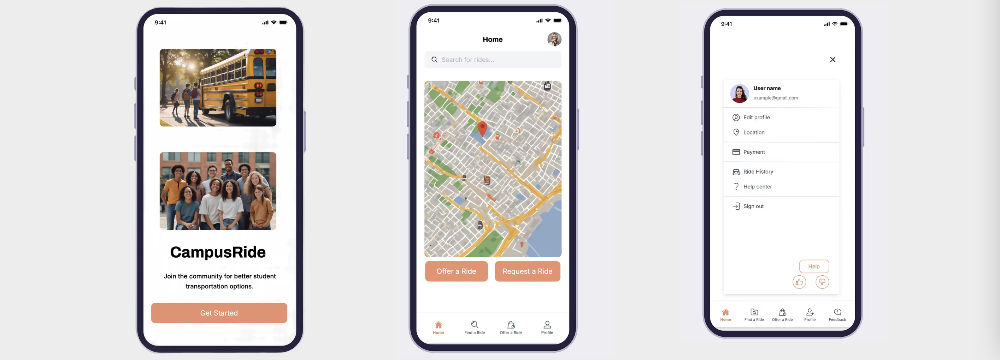

# 🚗 CampusRide – Student Carpool App (Case Study)

**Role:** UI/UX Designer  
**Duration:** February – Present  
**Tools:** Figma, Unsplash, Wix  

CampusRide is a ride-sharing app designed exclusively for students, enabling them to safely and affordably share rides within their campus community.

## 🎯 Project Goals

- Solve the issue of costly transportation for students.
- Provide a safe, student-only ride-sharing solution.
- Match students going in the same direction for shared travel.

## 📐 My Process

1. Conducted user research and surveys.
2. Created user personas and journey maps.
3. Designed wireframes and prototypes in Figma.
4. Conducted usability testing and iterated designs.
5. Presented final high-fidelity screens.

## 🖼️ Visual Case Study

### Image 1  

### Image 2  

### Image 3  

### Image 4  

### Image 5  

### Image 6  

### Image 7  

### Image 8  

### Image 9  

### Image 10  

### Image 11  

### Image 12  

### Image 13  

### Image 14  

### Image 15  

### Image 16  

### Image 17  

### Image 18  

### Image 19  

### Image 20  

### Image 21  

### Image 22  

### Image 23  

### Image 24  

### Image 25  

## 💡 Key Learnings

- Designed a scalable UI system for student transportation.
- Balanced usability and minimalism in the interface.
- Learned how to validate user pain points through research and feedback.

## 🌐 Portfolio Link

[View Case Study on Wix](https://sravyanallagantula.wixsite.com/sravya-nallagantula/portfolio-collections/my-work/my-work)
